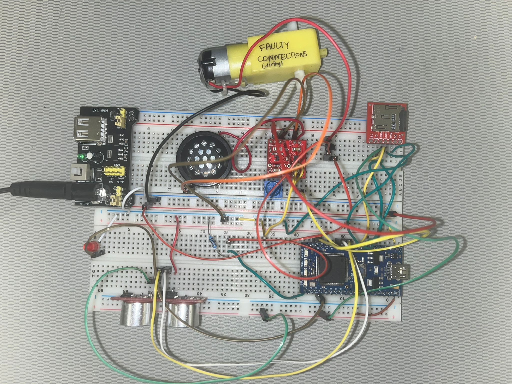
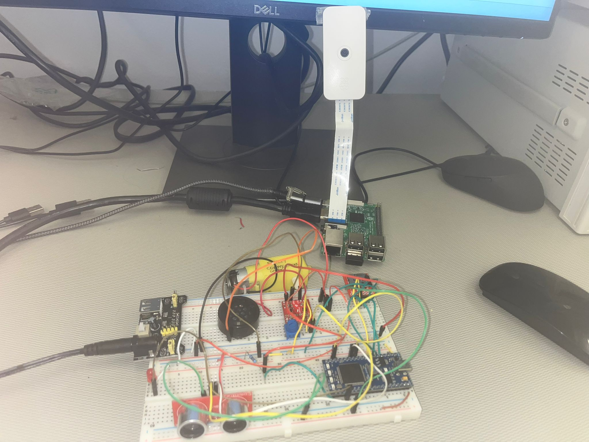

# Thief detecteion system (mbed 1769 + Raspberry Pi)

### Project idea

This project aims to implment a thief detection system for a room/house. The idea is to install a camera and an ultrasonic sensor on the room you want to secure. The ultrasonic points in one angle and the camera on a different one (ideally we would have multiple ultrasonic sensors and cameras, but for simplicity we just have one of each).

The ultrasonic detects a thief if he is close enough to the sensor. The camera is connected to a Raspberry Pi which is running an object detection model using tensorflow and opencv, so it detects the thief using this model. The mbed manages all the sensors and actuators using threads thanks to the RTOS library.

When a thief is detected, the alarm will sound on the speaker, a red blinking light will be turn on (a led for simplicity) and the door will be automatically closed (a motor in our case).

### Components

- mbed Microcontroller https://os.mbed.com/platforms/mbed-LPC1768/
- Class D Amplifier https://os.mbed.com/users/4180_1/notebook/tpa2005d1-class-d-audio-amp/
- Speaker https://os.mbed.com/users/4180_1/notebook/using-a-speaker-for-audio-output/
- uSD Card File System https://os.mbed.com/cookbook/SD-Card-File-System
- Potentiometer https://os.mbed.com/components/Potentiometer/
- HC-SR04 https://os.mbed.com/components/HC-SR04/
- DC motor https://www.bananarobotics.com/shop/Yellow-Gear-Motor-with-48-to-1-reduction-ratio
- 5V Power Supply (and adapter jack)
- Led
- Resistors
- Transistor
### Diagram
<br></br>

### Wiring
| **MBED1768** | **Component** | **Pin Name** | **Misc.** |
|--------------|--------------|--------------|--------------|
| p5 | uSD File System	  | SPI MOSI  | -  |
| p6  | uSD File System	  | SPI MISO  | -  |
| p7  | uSD File System	  | SPI SCLK  | - |
| p8  | uSD File System	  | CS  | -  |
| Vout  | uSD File System	  | VCC  | -  |
| Gnd  | uSD File System	  | Gnd  | -  |
| p18  | Class D Amplifier	  | in+  | - |
| -  | Class D Amplifier	  | pwr+  | 5V supply |
| GND  | Class D Amplifier	  | in-  | - |
| GND  | Class D Amplifier	  | pwr-  | - |
| -  | Class D Amplifier	  | out+  | speaker+ |
| -  | Class D Amplifier	  | out-  | speaker- |
| Vu(5V)  | HC-SR04  | Vcc  | - |
| Gnd  | HC-SR04  | Gnd  | - |
| p12  | HC-SR04  | trig  | - |
| p13  | HC-SR04  | echo  | - |
| -  | motor  | Vcc  | 5V supply (transistor) |
| Gnd  | motor  | Gnd  | - |
| p24  | LED  | Vcc  | - |
| Gnd  | LED  | Gnd  | - |
| p21  | Transistor  | base  | - |
| -  | Transistor  | emitter  | - |
| -  | Transistor  | collector  | - |

Additionally the camera is connected to Raspberry pi using the CSI interface and the mbed 1768 is connected to the Raspberry pi.

### Code
#### MBED code

The most important thing of the MBED code is the use of threads for each component

```
#include "Mutex.h"
#include "Thread.h"
#include "mbed.h"
#include "rtos.h"
#include "SDFileSystem.h"
#include "wave_player.h"
#include "ultrasonic.h"
#include <cstdio>
#include "Mutex.h"

Mutex thieve_m;
Serial  pi(USBTX, USBRX);
DigitalOut motor(p21);
DigitalOut red_led(p24);
bool thieves = 0;
DigitalOut led1(LED1);
SDFileSystem sd(p5, p6, p7, p8, "sd"); 
AnalogOut DACout(p18);
wave_player waver(&DACout);

void dist(int distance){
    
    if (distance < 700 && thieves == 0){
        thieve_m.lock();
        thieves = 1;
        Thread::wait(6000);
        thieves = 0;
        thieve_m.unlock();
    }
}
ultrasonic mu(p12, p13, .1, 1, &dist);    

void thread_Music(void const *args){
    while(true){
        if (thieves == 1){
        
            Thread::wait(500);
            FILE *wave_file;
            wave_file=fopen("/sd/music/sirena11.wav","r");
            if(wave_file==NULL) {
                printf("file open error!\n\n\r");
            }
            waver.play(wave_file);
            fclose(wave_file);  
            Thread::wait(200);   
        }
    }
}

void thread_ultrasonic(void const * args){

    mu.startUpdates();
    while(1){
        mu.checkDistance();    
        Thread::wait(50);
    }

}

void thread_motor(void const * args){
    while(1)
    {
        if (thieves == 1){
            motor = 1;
        }
        else{
            motor = 0;
        }
        Thread::wait(50);
    }
}

void thread_color(void const *args)
{
    while(true) {       
        if (thieves == 0){
            red_led = 0;      
        }
        else{
            red_led = !red_led;
        }
        Thread::wait(700);
    }
}

int main()
{
    Thread t2(thread_Music);
    Thread t3(thread_color);
    Thread t4(thread_ultrasonic);
    Thread t5(thread_motor);
    while(1){
        char val = 0;
        while(pi.readable()) {
            val = pi.getc();
            if(val == 'T' && thieves == 0){
                    thieve_m.lock();
                    thieves = 1;
                    Thread::wait(6000);
                    thieves = 0;
                    thieve_m.unlock();            
            }
        }
        Thread::wait(500);
    }
}
```

#### Rasperry pi code
This code uses OpenCV (library for computer vision) to implement the real time object detection system on the Raspberry Pi using a pre-trained model. It also uses serial communications to interact the mbed. The script continuously captures images from the camera and processes these images to detect and annotate objects with bounding boxes and confidence scores. If a person is detected then it will communicate with the mbed using serial communication so the mbed can triger the alar. 

```
# Import the Open-CV extra functionalities
import cv2
import os
from picamera2 import Picamera2
from comu2 import communications, fake
import time
import serial


def communications(fake=False):
    try:
        ser = serial.Serial('/dev/ttyACM0', 9600, timeout=1)
    except serial.SerialException as e:
        print(f"Error opening serial port: {e}")
        return -1

    ser.bytesize = serial.EIGHTBITS    
    ser.parity = serial.PARITY_NONE    
    ser.stopbits = serial.STOPBITS_ONE  
    ser.timeout = 0

    try:
        if (fake):
            ser.write(b"B\r")
        else:
            ser.write(b"T\r")
        time.sleep(2)  
    except serial.SerialTimeoutException:
        print("Write timeout error")
        return -1
    ser.close()


users = []
users.append(os.getlogin())

classNames = []
classFile = "/home/" + users[0] + "/Desktop/Object_Detection_Files/coco.names"
with open(classFile, "rt") as f:
    classNames = f.read().rstrip("\n").split("\n")

configPath = "/home/" + \
    users[0] + "/Desktop/Object_Detection_Files/ssd_mobilenet_v3_large_coco_2020_01_14.pbtxt"
weightsPath = "/home/" + \
    users[0] + "/Desktop/Object_Detection_Files/frozen_inference_graph.pb"

net = cv2.dnn_DetectionModel(weightsPath, configPath)
net.setInputSize(320, 320)
net.setInputScale(1.0 / 127.5)
net.setInputMean((127.5, 127.5, 127.5))
net.setInputSwapRB(True)


def getObjects(img, thres, nms, draw=True, objects=[]):
    classIds, confs, bbox = net.detect(
        img, confThreshold=thres, nmsThreshold=nms)
    # print(classIds,bbox)
    if len(objects) == 0:
        objects = classNames
    objectInfo = []
    if len(classIds) != 0:
        for classId, confidence, box in zip(classIds.flatten(), confs.flatten(), bbox):
            className = classNames[classId - 1]
            if className in objects:
                objectInfo.append([box, className])
                if (draw):
                    cv2.rectangle(img, box, color=(0, 255, 0), thickness=2)
                    cv2.putText(img, classNames[classId-1].upper(), (box[0]+10, box[1]+30),
                                cv2.FONT_HERSHEY_COMPLEX, 1, (0, 255, 0), 2)
                    cv2.putText(img, str(round(confidence*100, 2)), (box[0]+200, box[1]+30),
                                cv2.FONT_HERSHEY_COMPLEX, 1, (0, 255, 0), 2)

    return img, objectInfo


if _name_ == "_main_":
    communications(True)
    picam2 = Picamera2()
    picam2.configure(picam2.create_preview_configuration(
        main={"format": 'XRGB8888', "size": (640, 480)}))
    picam2.start()

    while True:
        img = picam2.capture_array("main")
        img = cv2.cvtColor(img, cv2.COLOR_BGRA2BGR)
        result, objectInfo = getObjects(img, 0.45, 0.2)
        print(objectInfo)

        for arr in objectInfo:

            if arr[1] == 'person':
                print('Thief')
                communications()
                time.sleep(2)
                break

        # cv2.imshow("Output",img)

        k = cv2.waitKey(200)
        if k == 27:    # Esc key to stop
            # EXIT
            picam2.stop()
            cv2.destroyAllWindows()
            break

```

### Set-up instructions

- Wire the circuit as in the images
- Connect camera to the Pi, make sure it works
- Load the code into mbed
- Create python script with the code provided for the raspberry
- Connect Pi to mbed
- Execute python script on the raspberry

### Images




### Video

https://www.youtube.com/watch?v=e2ACNT02rpE

### Conclusions + future work

In this project we have showcased the capabilities of the mbed at the time of managing multple compenents using threads and connecting to a raspeberry pi for recieving data. Adittionally we have showed how to run object detection models on the raspberry pi.

For future enhancements it would be interesting to install a camera that could rotate in all angles. Installing more ultrasonic sensors could also result in a more capable system.
Finally it would also be important to integrate all the wiring within one single box.

### Team members
Alejandro Cañada Hinojosa


